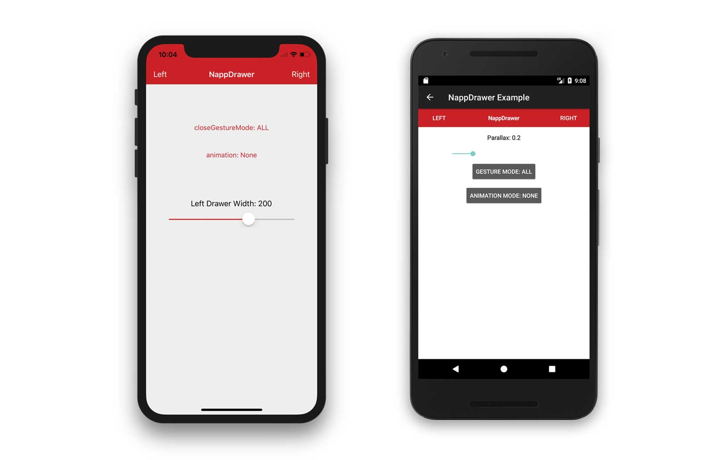

# Titanium Napp Drawer Module

[](http://gitt.io/component/dk.napp.drawer)
[](https://www.npmjs.com/package/ti-module-dk.napp.drawer)



## Description

The **Napp Drawer** module extends the Appcelerator Titanium Mobile framework with a cross-platform side-drawer navigation component. It provides a familiar sliding menu pattern used by popular apps like Facebook, Gmail, and LinkedIn.

**Platform Implementation:**
- **iOS**: Based on [MMDrawerController](https://github.com/MortimerGoro/MMDrawerController) — supports left, right, and center panels with smooth animations
- **Android**: Based on [SlidingMenu](https://github.com/jfeinstein10/SlidingMenu) — supports left and right panels with customizable animations

**Cross-Platform Parity:** Despite different underlying implementations, the API is consistent across platforms. Use the same properties and methods on both iOS and Android.

---

## Quick Start

### Basic Usage

```javascript
var NappDrawer = require('dk.napp.drawer');
var drawer = NappDrawer.createDrawer({
  leftWindow: leftWin,
  centerWindow: centerWin,
  leftDrawerWidth: 280,
  animationMode: NappDrawer.ANIMATION_SLIDE
});

drawer.openLeftWindow();
```

---

## API Reference

### Module Constants

#### Animation Modes

| Constant | Value | Description |
|----------|-------|-------------|
| `ANIMATION_SLIDE` | `1` | Scale animation — center view scales down |
| `ANIMATION_SLIDE` | `2` | Slide animation — center view slides up |
| `ANIMATION_PARALLAX_FACTOR_3` | `4` | Parallax with factor 3.0 |
| `ANIMATION_PARALLAX_FACTOR_5` | `5` | Parallax with factor 5.0 |
| `ANIMATION_PARALLAX_FACTOR_7` | `7` | Parallax with factor 7.0 |
| `ANIMATION_FADE` | `7` | Fade animation |
| `ANIMATION_NONE` | `100` | No animation |

> **Note:** Android supports `ANIMATION_SCALE`, `ANIMATION_SLIDEUP`, `ANIMATION_ZOOM` internally. iOS uses `slideAndScale`, `slide`, `parallax`, `fade`, `none`.

#### Open/Close Gesture Modes

| Constant | iOS | Android | Description |
|----------|-----|---------|-------------|
| `CLOSE_MODE_NONE` | `MMCloseDrawerGestureModeNone` | `TOUCHMODE_NONE` | No gesture to close |
| `CLOSE_MODE_ALL` | `MMCloseDrawerGestureModeAll` | `TOUCHMODE_FULLSCREEN` | Tap/pan anywhere to close |
| `CLOSE_MODE_PANNING_NAVBAR` | `MMCloseDrawerGestureModePanningNavigationBar` | — | Pan navigation bar to close |
| `CLOSE_MODE_PANNING_CENTERWINDOW` | `MMCloseDrawerGestureModePanningCenterView` | — | Pan center view to close |
| `CLOSE_MODE_BEZEL_PANNING_CENTERWINDOW` | `MMCloseDrawerGestureModeBezelPanningCenterView` | — | Pan bezel area to close |
| `CLOSE_MODE_TAP_NAVBAR` | `MMCloseDrawerGestureModeTapNavigationBar` | — | Tap navigation bar to close |
| `CLOSE_MODE_TAP_CENTERWINDOW` | `MMCloseDrawerGestureModeTapCenterView` | — | Tap center view to close |
| `CLOSE_MODE_PANNING_DRAWER` | `MMCloseDrawerGestureModePanningDrawerView` | — | Pan drawer view to close |
| `OPEN_MODE_ALL` | `MMOpenDrawerGestureModeAll` | `TOUCHMODE_FULLSCREEN` | Any gesture to open |
| `OPEN_MODE_PANNING_NAVBAR` | `MMOpenDrawerGestureModePanningNavigationBar` | `TOUCHMODE_MARGIN` | Pan navigation bar to open |
| `OPEN_MODE_PANNING_CENTERWINDOW` | `MMOpenDrawerGestureModePanningCenterView` | — | Pan center view to open |
| `OPEN_MODE_BEZEL_PANNING_CENTERWINDOW` | `MMOpenDrawerGestureModeBezelPanningCenterView` | — | Pan bezel area to open |

#### Status Bar Styles

| Constant | Value | Description |
|----------|-------|-------------|
| `STATUSBAR_BLACK` | `UIStatusBarStyleDefault` | Dark status bar text |
| `STATUSBAR_WHITE` | `UIStatusBarStyleLightContent` | Light status bar text |

#### Status Bar Animation

| Constant | Value | Description |
|----------|-------|-------------|
| `STATUSBAR_ANIMATION_NONE` | `0` | No animation |
| `STATUSBAR_ANIMATION_FADE` | `1` | Fade animation |
| `STATUSBAR_ANIMATION_SLIDE` | `2` | Slide animation |

---

### Properties

| Property | Type | Default | Description |
|----------|------|---------|-------------|
| `leftWindow` | TiViewProxy | `null` | Left drawer window/view proxy |
| `rightWindow` | TiViewProxy | `null` | Right drawer window/view proxy |
| `centerWindow` | TiViewProxy | `null` | Center content window/view proxy |
| `leftDrawerWidth` | Number/String | `-100` | Left drawer width in pixels or dimension string (e.g., `"280dp"`) |
| `rightDrawerWidth` | Number/String | `-100` | Right drawer width in pixels or dimension string |
| `openDrawerGestureMode` | Number | `OPEN_MODE_ALL` | Gesture mode for opening the drawer |
| `closeDrawerGestureMode` | Number | `CLOSE_MODE_ALL` | Gesture mode for closing the drawer |
| `animationMode` | Number | `ANIMATION_SLIDE` | Animation mode for drawer transitions |
| `animationVelocity` | Number | `1.0` | Animation velocity factor |
| `shouldStretchDrawer` | Boolean | `false` | Enable elastic stretch effect on drawer |
| `showShadow` | Boolean | `true` | Show shadow behind drawer |
| `shadowWidth` | Number/String | `0` | Shadow width in pixels or dimension string |
| `fading` | Number | `0.0` | Fade degree (0.0–1.0) for center view when drawer is open |
| `parallaxAmount` | Number | `0.0` | Parallax scroll scale (0.0–1.0) |
| `showStatusBarView` | Boolean | `true` | Show status bar background view |
| `statusBarStyle` | Number | `STATUSBAR_BLACK` | Status bar text color style |
| `centerHiddenInteractionMode` | Number | — | Interaction mode when center is hidden |
| `autoCloseWindows` | Boolean | `true` | Automatically close windows on drawer close |
| `backgroundColor` | TiBlob | — | Background color of the drawer view |
| `hamburgerIcon` | Boolean | `false` | Show hamburger icon on Android |
| `hamburgerIconColor` | String | `null` | Custom hamburger icon color (hex string) |
| `arrowAnimation` | Boolean | `false` | Animate hamburger icon to arrow on Android |
| `orientationModes` | Array | — | Supported orientation modes |

---

### Methods

#### Window Management

| Method | Parameters | Description |
|--------|-----------|-------------|
| `openLeftWindow(animated)` | `animated` (Boolean, optional) | Open the left drawer |
| `openRightWindow(animated)` | `animated` (Boolean, optional) | Open the right drawer |
| `closeLeftWindow(animated)` | `animated` (Boolean, optional) | Close the left drawer |
| `closeRightWindow(animated)` | `animated` (Boolean, optional) | Close the right drawer |
| `closeWindows(animated)` | `animated` (Boolean, optional) | Close all open drawers |
| `toggleLeftWindow(animated)` | `animated` (Boolean, optional) | Toggle left drawer open/closed |
| `toggleRightWindow(animated)` | `animated` (Boolean, optional) | Toggle right drawer open/closed |
| `bounceLeftWindow(animated)` | `animated` (Boolean, optional) | Bounce open the left drawer |
| `bounceRightWindow(animated)` | `animated` (Boolean, optional) | Bounce open the right drawer |

#### State Queries

| Method | Returns | Description |
|--------|---------|-------------|
| `isLeftWindowOpen()` | Boolean | Check if left drawer is open |
| `isRightWindowOpen()` | Boolean | Check if right drawer is open |
| `isAnyWindowOpen()` | Boolean | Check if any drawer is open |
| `getRealLeftViewWidth()` | Number | Get actual left drawer width in pixels |
| `getRealRightViewWidth()` | Number | Get actual right drawer width in pixels |

#### Status Bar (iOS)

| Method | Parameters | Description |
|--------|-----------|-------------|
| `showStatusBar(animationStyle)` | `animationStyle` (Number, optional) | Show the status bar |
| `hideStatusBar(animationStyle)` | `animationStyle` (Number, optional) | Hide the status bar |
| `setStatusBarStyle(style)` | `style` (Number) | Set status bar text color |

---

### Events

| Event | Data | Description |
|-------|------|-------------|
| `windowDidOpen` | `{window: "left" \| "right"}` | Fired when a drawer is opened |
| `windowDidClose` | `{}` | Fired when a drawer is closed |
| `didChangeOffset` | `{offset: Number}` | Fired continuously as drawer scrolls (0.0–1.0) |
| `open` | — | Fired when drawer opens (gesture-based) |
| `close` | — | Fired when drawer closes (gesture-based) |
| `focus` | — | Window focus event |
| `blur` | — | Window blur event |
| `open` | — | Window open event |

---

## Examples

### Basic Left Drawer

```javascript
var NappDrawer = require('dk.napp.drawer');

var leftWin = Ti.UI.createWindow({
  backgroundColor: '#333'
});

var centerWin = Ti.UI.createWindow({
  backgroundColor: '#fff'
});

var drawer = NappDrawer.createDrawer({
  leftWindow: leftWin,
  centerWindow: centerWin,
  leftDrawerWidth: 280,
  animationMode: NappDrawer.ANIMATION_SLIDE
});

drawer.openLeftWindow();
```

### Left + Right Drawer

```javascript
var leftWin = Ti.UI.createWindow({ backgroundColor: '#333' });
var rightWin = Ti.UI.createWindow({ backgroundColor: '#666' });
var centerWin = Ti.UI.createWindow({ backgroundColor: '#fff' });

var drawer = NappDrawer.createDrawer({
  leftWindow: leftWin,
  rightWindow: rightWin,
  centerWindow: centerWin,
  leftDrawerWidth: 280,
  rightDrawerWidth: 280,
  animationMode: NappDrawer.ANIMATION_PARALLAX_FACTOR_5
});

drawer.addEventListener('windowDidOpen', function(e) {
  Ti.API.info('Opened: ' + e.window);
});
```

### Hamburger Icon (Android)

```javascript
var drawer = NappDrawer.createDrawer({
  leftWindow: leftWin,
  centerWindow: centerWin,
  hamburgerIcon: true,
  hamburgerIconColor: '#ffffff',
  arrowAnimation: true
});
```

---

## Platform Differences

| Feature | iOS | Android |
|---------|-----|---------|
| Base Library | MMDrawerController | SlidingMenu |
| Panel Types | Windows | Views |
| Right Drawer | ✅ | ✅ |
| Parallax | ✅ (3.0, 5.0, 7.0) | ✅ (via parallaxAmount) |
| Bounce Animation | ✅ | ✅ |
| Hamburger Icon | ❌ | ✅ |
| Status Bar APIs | ✅ | ❌ |
| Orientation Modes | ✅ | ✅ |

---

## Requirements

- **Titanium SDK**: 13.2.0+
- **iOS**: 13.0+
- **Android**: API 21+

---

## License

MIT License — Copyright (c) 2010-2013 Napp ApS  
Modified by Marc Bender

See [LICENSE](LICENSE) for details.

---

## Community

Contributions welcome! Please submit Pull Requests.

**Author:** Mads Møller  
web: http://www.napp.dk  
email: mm@napp.dk  
twitter: @nappdev

**Maintainer:** Marc Bender
